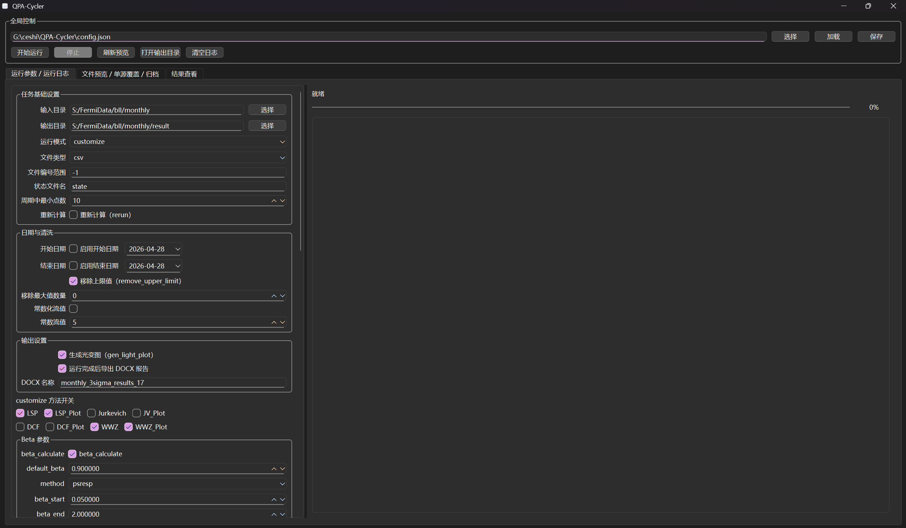

# QPA-Cycler：多方法准周期分析自动化流水线

**QPA-Cycler** (Quasi-Periodicity Analysis Cycler) 是一款专为时间序列数据（特别是天文光变曲线等**非均匀采样数据**）设计的自动化周期检测工具。它集成了多种经典的周期分析算法，实现了从数据预处理到自动化生成研究报告的全流程覆盖。

## 核心架构：自动化周期检测流程
该工具遵循以下标准处理流水线：
**数据读取 → 数据预处理 → 模式与算法选择 → 周期性分析 → 结果可视化 → 自动化文档导出**


## 🌟 核心特性

1.  **交互式 GUI 界面**：摆脱繁琐的 JSON 配置文件，通过可视化窗口直接设置参数、选择数据、监控运行状态与查看结果。
2.  **多算法集成**：内置 DCF、Jurkevich (PDM)、Lomb-Scargle (LSP)、WWZ (加权波谱分析) 及谐波分析等主流周期检测算法。
3.  **非均匀采样支持**：针对天文观测等存在间隙或采样不均的数据进行了算法优化。
4.  **实时状态反馈**：GUI 界面集成了日志输出窗口，计算进度一目了然。
5.  **高度程序自动化**：支持通过配置文件（`config.json`）批量处理多个数据源，算法参数直观可调。
6.  **容错与断点续传**：
    *   **分钟级自动备份**：程序运行期间每分钟更新一次中间状态。
    *   **状态恢复**：若程序意外中断，可通过读取状态文件从断点处继续运行。
7.  **专业化结果输出**：
    *   **一键制图**：生成光变曲线图、功率谱图、相位折叠图等。
    *   **Word报告导出**：通过 `save2docx.py` 将分析参数、中间图表、计算结果自动整理为结构化的 Word 文档。
8.  **仿真数据生成**：内置模拟信号生成工具，便于测试算法精度与可靠性。

---

## 🛠️ 环境开发与安装

### 依赖项
- Python 3.8 或更高版本
- 核心库：`numpy`, `pandas`, `matplotlib`, `scipy`, `python-docx`, `PySide6`

### 安装步骤
1. 克隆仓库：
   ```bash
   git clone https://github.com/LaoHTui/QPA-Cycler.git
   cd QPA-Cycler
   ```
2. 安装依赖：
   ```bash
   pip install numpy pandas matplotlib scipy python-docx PySide6
   ```

---


## 🖥️ 界面展示与使用



### 1. 启动程序
打开终端并运行 GUI 启动脚本：
```bash
python gui_app.py
```

### 2. 操作流程
1.  **路径设置**：在界面顶部选择您的“数据文件夹路径”和“结果保存路径”。
2.  **模式切换**：选择 **Auto（自动模式）** 由程序自动选择最优参数，或选择 **Customize（自定义模式）** 手动调整各算法参数。
3.  **选择算法**：在勾选框中选择您想要运行的算法（LSP, WWZ, Jurkevich 等）。
4.  **参数微调**：在界面参数栏中设置采样步长、频率范围等关键指标。
5.  **一键运行**：点击“开始分析”按钮，程序将自动按序执行。
6.  **生成报告**：计算完成后，切换至“报告工具”分页，点击“生成 Word 文档”，即可在输出目录获得完整报告。

---

## 📊 算法与结果说明

### 内置算法库
*   **Lomb-Scargle (LSP)**：最常用的非均匀采样周期检测方法。
*   **Weighted Wavelet Z-transform (WWZ)**：分析周期随时间演化的时频分析工具。
*   **Jurkevich / PDM**：基于相位折叠离散度的非参方法。
*   **DCF**：离散相关函数分析。

### 结果文件夹结构
计算完成后，程序会自动创建以下结构：
- **`Light_Slot/`**: 存放所有源的光变曲线图。
- **`Running_data/`**: 存放 `state` 状态文件（用于断点恢复）和当前运行的配置副本。
- **`Images/`**: 存放 LSP、WWZ 等各算法生成的分析谱图。
- **`Result-Report.docx`**: 最终生成的综合分析报告。

---

## 🧪 模拟数据测试
如果您是第一次使用，可以利用内置的模拟功能：
1.  点击“模拟数据生成”按钮。
2.  输入预期的周期值（如 245.7 天）和噪声水平。
3.  点击生成，程序将自动创建数据集供您练习分析流程。


## 📂 项目结构说明

*   `main.py`: 核心运行程序。
*   `save2docx.py`: 报告生成模块。
*   `gen_sumulated_data.py`: 信号模拟模块。
*   `config.json`: 全局参数配置文件。
*   `docs/`: 详细的算法原理、参数设置及各模块说明文档。
*   `example/`: 包含可供参考的输入示例及输出结果样本。


## ⚠️ 开发说明与免责声明
本项目由开发者在本科阶段基于科研需求开发，旨在增加周期性分析工作的自动化与便捷性。由于开发者知识视野及学力水平有限，算法实现或代码结构可能并非最优解。

**欢迎贡献：**
如果您在使用中发现 Bug，或有更好的算法实现优化建议，欢迎提交 **Pull Request** 或开 **Issue** 讨论。

**联系方式：**
📧 Email: `hczhang@my.swjtu.edu.cn`

---
*本项目遵循相关的开源协议，引用或使用请注明出处。*
