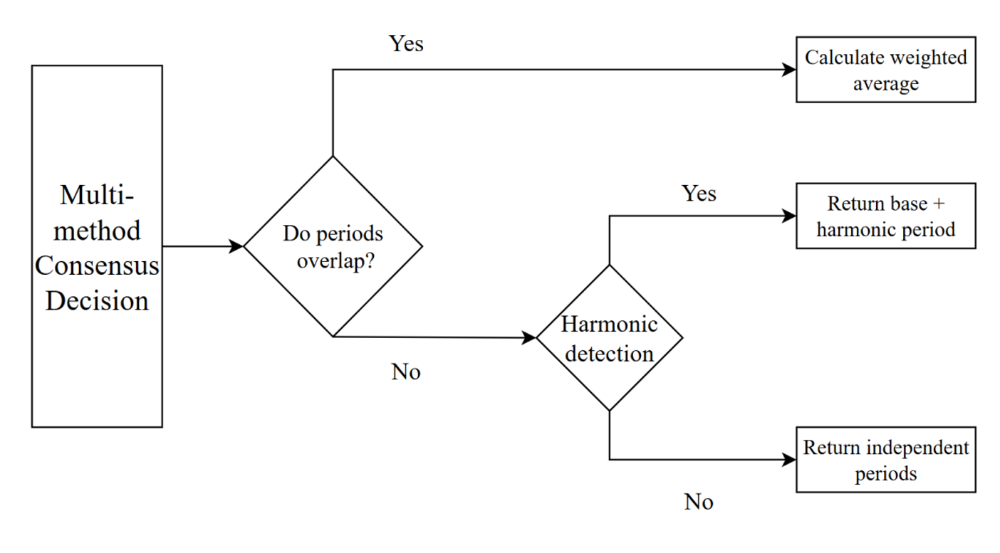
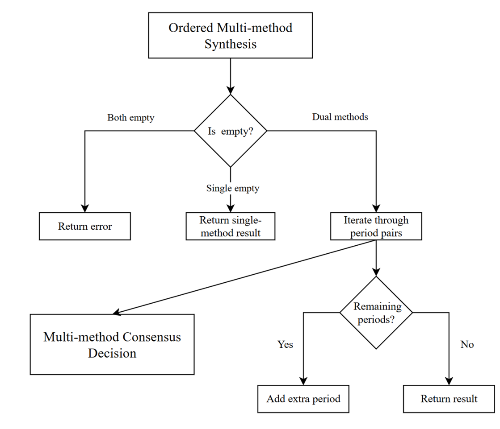
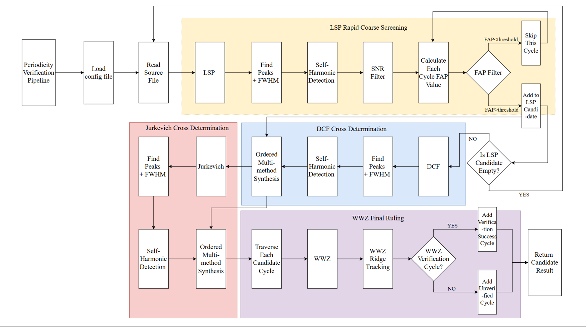

# QPA-Cycler

## Automated Multi-method Quasi-Periodicity Detection Pipeline

QPA-Cycler 是一个多方法交叉自动化检测准周期候选源的管道，集成了多种周期检测算法，通过多方法交叉验证来提高准周期信号检测的准确性。

> [!Note]
> 具体公式内容与测试运行结果详见[说明文档pdf](QPACycler_Algorithm_Introduction.pdf)

## 算法原理介绍

### Lomb-Scargle Periodogram (LSP)

LSP 是一种针对非均匀采样时序数据的频谱分析方法，能有效检测隐藏的周期性信号。其通过最小二乘法拟合不同频率的正弦波，计算其功率谱。

#### 统计显著性检验

- **信噪比 (Signal-to-Noise Ratio - SNR)**

- **假警报概率 (False Alarm Probability - FAP)**：使用蒙特卡洛模拟方法，基于幂律噪声的生成模型                        $P(f) \propto f^{-\alpha}$                       。

### 离散相关系数 (DCF)

DCF 用于测量两个时间序列在不同时间滞后下的相关性，特别适用于不规则采样的数据。

#### 核心公式

装箱后的离散相关函数值：
 $DCF_{ij}=\frac{(x(t_i)-\bar{x})(y(t_j)-\bar{y})}{\sigma_x \sigma_y}$    
 
对有噪数据：
 $DCF_{ij}=\frac{(x(t_i)-\bar{x})(y(t_j)-\bar{y})}{\sqrt{(\sigma_x^2-\sigma_{x,e}^2)(\sigma_y^2-\sigma_{y,e}^2)}}$ 

### Jurkevich 方法 (JV)

一种基于数据均方差期望原理的周期提取算法。具体详见pdf

### 加权小波 Z - 变换 (WWZ)

WWZ 是一种强大的时频分析方法，特别适用于分析非平稳（频率和振幅随时间变化）的时间序列信号。

#### 影响锥 (Cone of Influence - COI)

 $\tau_{COI} \in [t_{min}+\frac{1}{2f\Delta t}, t_{max}-\frac{1}{2f\Delta t}]$                      ，COI 之外的 $Z$ 值应被忽略。

#### 脊线追踪 (Ridge Tracking)

$R(\tau)=Peak(Z(\tau,f))$  

脊线连接条件：   
$$\frac{|R(\tau)-R(\tau-1)|}{R(\tau)}<\epsilon$$ 

#### 漂移判定

简单线性回归模型：   $f(t) = \alpha_1 t + \alpha_0 + \epsilon$    

其中
- $\alpha_1$ 是漂移率（单位：Hz/day 或 Hz/s）
- $\alpha_0$ 是截距，其符号决定了漂移方向
- $\epsilon$ 是误差项。
  
置信区间  $CI_{\alpha_1} = [\alpha_1 - t_{\alpha/2, n-2} \cdot SE(\alpha_1), \alpha_1 + t_{\alpha/2, n-2} \cdot SE(\alpha_1)]$ 
其中，n 是样本量（数据点个数），α 为显著性水平，SE 估计标准误，区间外为漂移，内为稳定。

### 谐波判定方法

从一组带误差的候选周期中，自动识别并筛选出基波，同时标记出哪些是它们的谐波。

#### 计算周期比值及其不确定性 (误差传播)

 $r=\frac{T_i}{T_j}$   
 
 $\sigma_r=r\cdot\sqrt{(\frac{\sigma_{T_i}}{T_i})^2 + (\frac{\sigma_{T_j}}{T_j})^2}$   
 
判定条件为：
$|r-r_{harmonic}|\leq\sigma_{harmonic}$   
其中 $r_{harmonic}$ 为可能整数比，$\sigma_{harmonic}$为显著性阈值。

### FWHM 全高半宽

$FWHM = T_{high} - T_{low}$   

边界插值公式： 
 $T_{bound} = T_k + (T_{k+1}-T_k) \cdot \frac{y_{peak}-y_{bound}}{y_{k+1}-y_k}$   
 
测量不确定度估计： $\sigma_{FWHM} = \Delta T \cdot \sqrt{2}$ 

## **周期性验证管道 (PVP)**   

### 多方法一致性决策(Multi-method Consensus Decision)

通过多种周期检测方法的结果进行交叉验证，只有当多种方法都检测到相同的周期信号时，才判定为存在周期性信号，提高检测的准确性。   

### 有序多方法合成策略(Ordered Multi-method Synthesis)

按照不同方法的检测性能和适用场景，有序地组合多种方法，先使用计算量较小、检测速度快的方法进行初步筛选，再使用更复杂、更准确的方法进行验证，提高检测效率和准确性。

### 周期性验证管道流程(Periodicity Verification Pipeline)

1. 输入非均匀采样时间序列数据

2. 分别使用 LSP、DCF、JV、WWZ 等方法进行周期检测

3. 对各方法的检测结果进行一致性验证

4. 使用谐波判定方法筛选基波和谐波

5. 计算 FWHM 全高半宽，确定周期的精度

6. 输出最终的周期性检测结果

## 说明

欢迎提交 Pull Request 来改进这个项目。如果你发现了 bug 或者有新的功能需求，可以提交 Issue。

## 许可证

本项目采用 MIT 许可证，详情请见 LICENSE 文件。
