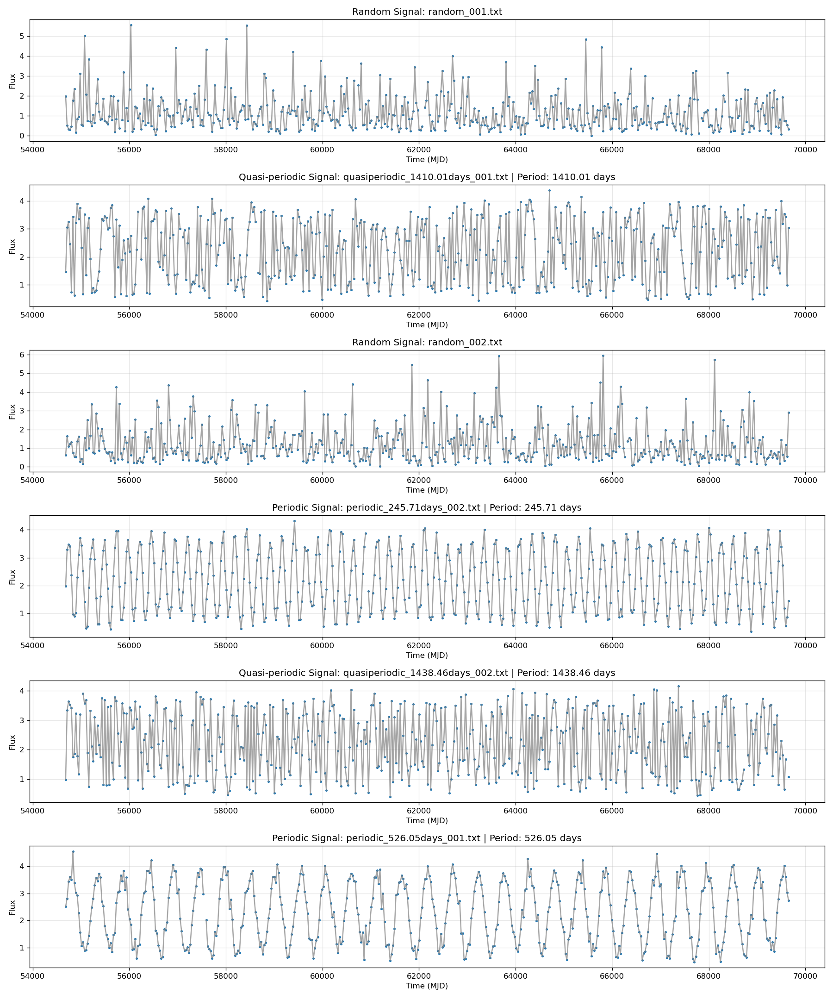
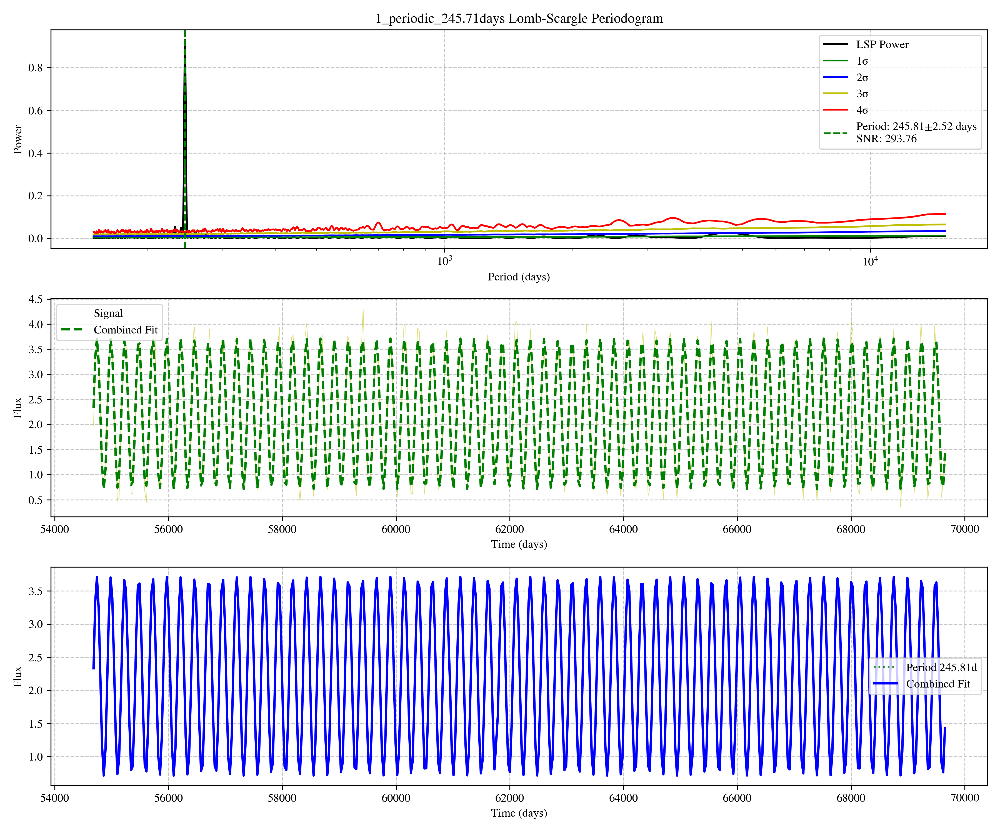
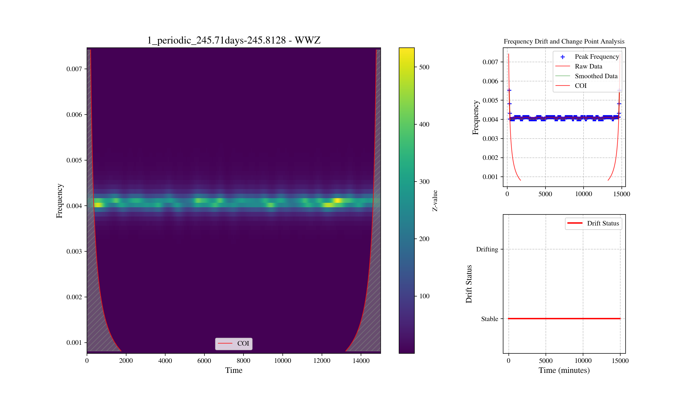

# QPA-Cycler

## Automated Multi-method Quasi-Periodicity Detection Pipeline

QPA-Cycler全称Quasi-Periodic Analysis - Cycler（准周期循环分析程序）,Cycler表示循环检测与自动化流程。  
QPA-Cycler是一套面向时序数据周期分析的 Python 工具集，核心聚焦非均匀采样时序数据（如天文领域光变曲线）的周期检测，整合了多种经典周期分析算法，提供 **「数据读取→数据预处理→模式选择→算法分析→结果可视化→计算结果文档导出」** 全流程能力。目的旨在自动化处理非均匀采样时序数据（如天文领域光变曲线）的周期检测,并得到可靠候选源。

> [!Note]
> 📖 中文详细使用文档：[中文文档](docs/README_zh.md)  
> 📝 算法原理详解：[算法文档](algorithms/README.md)  


> [!Important]
> ## 功能特性
> 1.**多算法支持**：集成 DCF、Jurkevich、Lomb-Scargle、WWZ、谐波分析等经典周期检测算法；  
> 2.**高自由度分析**：通过对源文件编号实现多个/多端读取，参数直观可调；  
> 3.**防崩溃备份**：程序每隔1分钟会生成分析结果数据备份，且程序可通过读取状态文件从中断处继续运行；  
> 4.**可视化能力**：一键生成光变曲线、周期分析结果图表；  
> 5.**结果导出**：支持将分析结果整理为结构化表格并导出为 Word 文档；  
> 6.**灵活数据处理**：支持 CSV/TXT 格式时序数据读取，内置模拟数据生成功能；  
> 7.**数据预处理**：提供自动滤波方法，提升周期检测精度。  

## 快速开始
### 环境依赖
- Python ≥ 3.8
- 依赖库：numpy、pandas、matplotlib、scipy、python-docx

### 安装依赖
确保安装以下 Python 库（建议使用 `pip` 安装）：
```bash
pip install numpy pandas matplotlib scipy python-docx
```

## 基本使用流程
* 1.配置参数config.json`，自定义数据路径、数据格式、分析算法参数、输出路径等；
> [!Tip]
> 具体参数说明与用法详见[ZH](README_config_zh.md)|[EN](README_config_en.md)

* 2.在主程序输入参数文件名字（若为config.json则无需改变）   
  运行主程序
```bash
python main.py
```
> [!Warning]
> config参数设置很重要，使用时一定要先理解其说明文档！

* 3.查看结果：
分析结果会输出在config.json中你设置好的路径里，同时会生成文件夹包括
  - backup：里面每隔1分钟会生成一个，可以替代state文件
  - Light_Plot：如果你选择了生成光变曲线图像会生成在里面
  - Running_Data：程序结束后，会将参数文件复制一份在这里（为此次运行的参数集）与状态文件放在一起（包含所有方法运行结果），对于模拟数据，其准确度结果也保存在这里
  - 方法结果的图片（原本应该分类，不过为了docx读取更简便）
* 4。[可选]将分析结果整理为结构化表格并导出为 Word 文档
  运行save2docx程序
```bash
python save2docx.py
```
程序会读取分析结果中的状态文件与参数文件，并在结果文件夹中生成 Word 文档

> [!Note]
> save2docx用法具体见[]()|[]()

## 使用示例
### 这里用本工具集里内置模拟数据生成功能来举例子  

1. 设置模拟数据输出路径(本例为"S:\\example\\data")   
   并运行 gen_sumulated_data.py
  ```bash
  python gen_sumulated_data.py
  ```
> [!Tip]
> 具体说明详见[]()



2. 在main中设置参数文件名字，并设置参数文件的源文件入口与结果输出路径
   json结构中设置
   ```bash
   "folder_path" : "S:\\example\\data",   
   "output_path" : "S:\\example\\result",
    ```
3. 设置全局参数文件(config.json中)
   - 设置文件读取范围，这里设置"-1"(意为全读取)
   - 选择模式(auto/customize) 若为auto，在auto模块中调节对应参数，若为customiz，同样在对应模块调节参数，并且自定义选择算法
   - 设置状态文件名(默认state)
   - 设置读取文件类型(csv/txt)
   - 选择是否重新运行(rerun为True时，停止程序后重新开始，为False时，接着停止的源继续计算) 
> [!Tip]
> 参数具体说明详见[]()

4. 运行main.py，等待结果
  ```bash
python main.py
  ```

5. 运行结束，程序同步显示计算结果与结果保存路径
  ```bash
状态文件已经储存在：S:\example\result\Running_Data\state
*************************全部源已经计算完毕,程序运行时间：1047.569 秒*************************
```
### 示例周期数据结果
   


6. 在save2docx选择模拟数据板块后运行
  ```bash
python save2docx.py
```
得到综合结果，包括程序计算时间，参数列表，每个源的分析结构并配有书签，对于模拟数据则多出准确率，每个源计算结果标签等等

## 对于单方法分析，在每个方法中都有示例运用，替换路径调节参数即可 

## 说明
本项目是本科阶段编写的时序数据周期分析工具，受个人学识与经验所限，程序与算法难免存在不足与疏漏，并非最优实现。  
欢迎感兴趣的朋友一同交流、讨论，共同优化与完善。

欢迎提交 Pull Request 来改进这个项目。如果你发现了 bug 或者有新的功能需求，可以提交 Issue。

📧 联系邮箱：hczhang@my.swjtu.edu.cn

